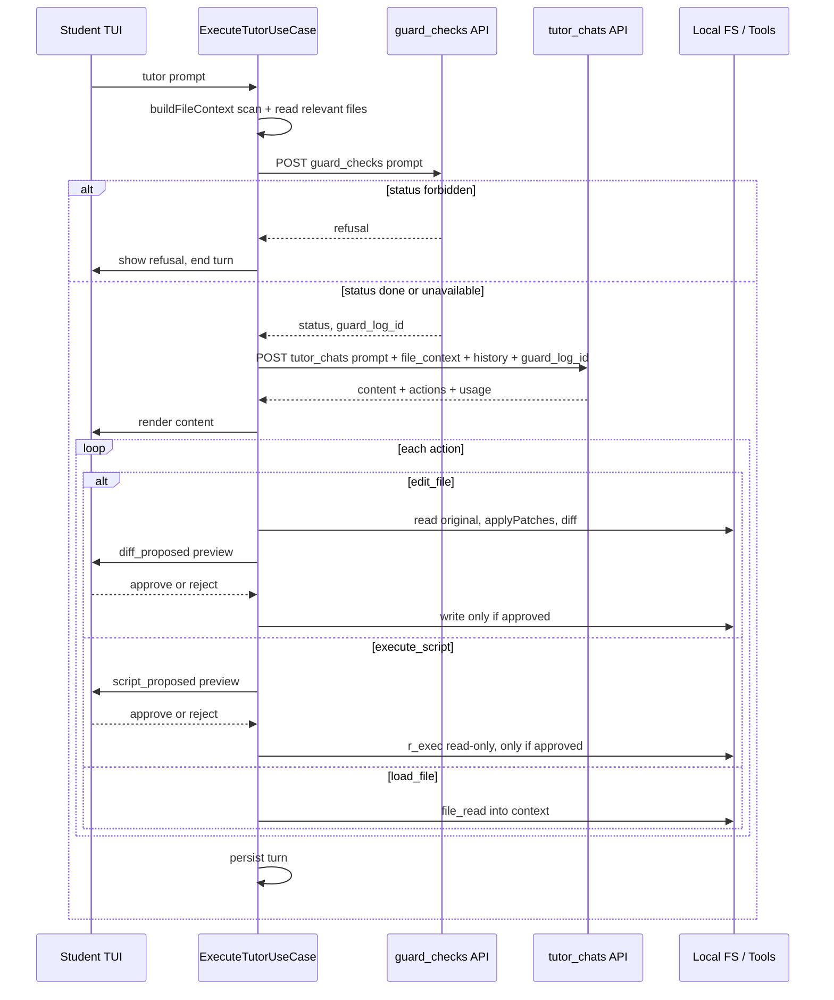

# Tyla CLI ↔ Tyla-api — Frontend Integration Reference

> **Scope:** how the MindyCLI TUI (frontend) talks to the Tyla-api backend. This is the
> **frontend's view** of the contract; the canonical, field-level endpoint specs live in
> the backend repo and are linked per endpoint. Where the two disagree, the backend docs win.
>
> **Status (2026-06-03):** the live pipeline is **`guard_checks` → `tutor_chats`**. The
> agentic additions — `file_context` (request) and `actions[]` (response) — are the
> **target** from [`plans/2026-06-03-agentic-tutor-react-pipeline.md`](../plans/2026-06-03-agentic-tutor-react-pipeline.md)
> (frontend) and `Tyla-api/plans/2026-06-03-agentic-tutor-backend.md` (backend). Parts not
> yet shipped are marked **TARGET**.
>
> **Superseded:** the previous `/resolve` + `/edit` Gemini pipeline (port 9090) is retired.
> The backend is now a guard + tutor service; see the git history of this file for the old contract.

---

## 1. Overview — the agentic tutor pipeline

A single student turn flows through **two backend endpoints** plus a frontend-side
action-dispatch step. The tutor can now *propose actions* (edit a file, run a script),
but **every file change passes through diff → preview → human approval → write**. The LLM
never writes to disk directly.



---

## 2. Base URL & configuration

```
http://<TYLA_API.HOST>:<TYLA_API.PORT>      # e.g. http://localhost:9292
```

Host/port come from the `TYLA_API` config constant
([cli config constants](../tyla/src/infrastructure/config/constants.ts)). The gateways
build the base URL from it; there is no separate per-endpoint host.

---

## 3. Authentication headers

Both endpoints take the **same four LLM headers**. The user supplies their own LLM
credentials; the backend forwards them to the provider for that one request and never
stores them.

| Header | Required | Description |
|--------|----------|-------------|
| `X-LLM-Key` | Required | API key (OpenAI key, Anthropic key, or GitHub PAT). Missing → `403`. |
| `X-LLM-Provider` | Optional | `openai` (default) or `anthropic`. |
| `X-LLM-Model` | Optional | Model id; falls back to `LLM_MODEL` env, then a server default. |
| `X-LLM-Endpoint` | Optional | Override base URL (e.g. GitHub Models). |

The frontend resolves these from `.env` via the config layer and attaches them in both
gateways.

---

## 4. Unified `status` enum

Both endpoints branch on a body `status` field (the HTTP code is a second, independent
layer — key off `status`):

```ts
type ApiStatus = 'done' | 'forbidden' | 'error' | 'unavailable';
```

| `status` | Meaning | Frontend behaviour |
|----------|---------|--------------------|
| `done` | guard passed / tutor replied | proceed / render |
| `forbidden` | guard blocked | show `refusal` (guard) / `content` (tutor); end turn |
| `unavailable` | guard LLM failed — fail-open | proceed; log warning |
| `error` | transport/validation/upstream failure (4xx/5xx) | show error; suggest retry |

`error` is the frontend's bucket for any non-2xx or unparseable body; on the wire those
use the shared error envelope `{ status, message, errors }`.

---

## 5. Endpoint 1 — `POST /api/v1/guard_checks` (pre-call)

The frontend calls this **first**, every turn, to run the safety judge on the student's
`prompt` only (no `file_context` — saves judge tokens). On `done` / `unavailable` it
proceeds to `tutor_chats`; on `forbidden` it shows the refusal and stops.

**Request body:** `{ course_id, project_id, student_id, prompt }`
**Response body:** `{ log_id, status, refusal?, usage }`

The returned `log_id` is passed to `tutor_chats` as **`guard_log_id`** — that route
verifies it (a DB check, no second guard LLM call) instead of re-running the guard. For
this to work the backend persists the judged `prompt` with the log.

> **Canonical spec:** `Tyla-api/doc/api_guard_checks.md`. The status-enum shape is a
> **TARGET** (live endpoint still returns `allowed: bool` until Workstream A ships).

Frontend component: `GuardCheckGateway` (mirrors `TutorChatGateway`).

---

## 6. Endpoint 2 — `POST /api/v1/tutor_chats`

Composes the full tutor prompt server-side from assignment artefacts + the request's
`file_context`, calls the tutor LLM, and returns text plus structured actions. **Verifies
the `guard_log_id`** from the pre-call against the DB (exists, status ∈ {`done`,
`unavailable`}, prompt matches) — a no-LLM check that replaces re-running the guard, so a
client can't skip `guard_checks` to bypass safety.

**Request body:** `{ course_id, project_id, student_id, guard_log_id, prompt, history, file_context? }`
- `guard_log_id` — **TARGET** — the `log_id` from the `guard_checks` pre-call; the backend
  verifies it instead of re-running the guard.
- `file_context` — **TARGET** — pre-assembled, token-budgeted workspace text built by the
  frontend (`buildFileContext()`), since the backend can't reach the local filesystem.

**Response body:** `{ log_id, status, content, actions?, usage }`
- `actions` — **TARGET** — structured suggestions the TUI executes behind approval (§7).

> **Canonical spec:** `Tyla-api/doc/api_tutor_chats.md`. The `status` enum + `usage` shape
> are live; `file_context` and `actions[]` are TARGET (Workstream B).

Frontend component: [`TutorChatGateway`](../tyla/src/infrastructure/api/tutor/tutor-chat-gateway.ts).

---

## 7. Actions & the approval gate (TARGET)

When `tutor_chats` returns `actions[]`, [`ExecuteTutorUseCase`](../tyla/src/application/use-cases/execute-tutor-use-case.ts)
renders `content`, then dispatches each action:

```ts
type TutorAction =
  | { type: 'edit_file';      path: string; patches: Array<{ start_line: number; search: string; replace: string }> }
  | { type: 'execute_script'; code: string }
  | { type: 'load_file';      path: string };
```

| Action | Frontend behaviour | Gate |
|--------|--------------------|------|
| `edit_file` | `file_read` → `applyPatches` → diff → `diff_proposed` event | **approval → write** (reuses `EditStagingService` + `FileEditTool`) |
| `execute_script` | `script_proposed` event with the code | **approval → `r_exec` (read-only)** |
| `load_file` | read file into context | none (read-only) |

Rules the frontend relies on (enforced by the backend prompt):
- `edit_file` uses **search-replace patches**, never full file content (4000-token output ceiling).
- Each patch carries **`start_line`** (1-based, the file line of `search`'s first line, read from
  the `N| ` prefix in the workspace context) plus **plain** `search`/`replace` content — no `N| `
  prefixes (plan [2026-06-13](../plans/2026-06-13-edit-file-line-anchor.md)). The frontend
  **anchors on `start_line`, verifies the slice against `search`** (CRLF-normalised), and applies
  only on a match — a mismatch is rejected, never silently misapplied. A patch missing `start_line`
  (XML fallback) degrades to a unique full-line text match.
- `execute_script` is **read-only** — changing files is `edit_file`'s job (which gets a diff).
- **No `actions` on `forbidden`/`error`.**

> **One-line takeaway:** the tutor can now act — but every file change still passes
> through diff + human approval. The LLM never writes to disk directly.

---

## 8. Usage accounting

Each turn produces **two** usage figures: the guard judge (`guard_checks.usage`) and the
tutor (`tutor_chats.usage`). The frontend tracks them separately (`guardUsage` /
`tutorUsage`) and sums for the [token status bar](../plans/2026-05-29-issue-3-tui-token-status-bar.md).

> The two figures are **disjoint** — `tutor_chats` no longer runs the guard (it only
> DB-verifies the `guard_log_id`), so its `usage` is tutor-only and the guard's tokens are
> counted exactly once via `guard_checks.usage`. No double-counting.

---

## 9. Frontend code map

| Concern | File |
|---------|------|
| Tutor pipeline (guard → tutor → actions) | [execute-tutor-use-case.ts](../tyla/src/application/use-cases/execute-tutor-use-case.ts) |
| Tutor gateway (`/tutor_chats`) | [tutor-chat-gateway.ts](../tyla/src/infrastructure/api/tutor/tutor-chat-gateway.ts) |
| Guard gateway (`/guard_checks`) | `infrastructure/api/guard/guard-check-gateway.ts` *(TARGET — to be added)* |
| Edit staging + write | `EditStagingService`, `FileEditTool` (single `fs.writeFileSync` site) |
| Tools (`file_read` / `pdf_read` / `r_exec` / `file_scan`) | `application/orchestration/tool-registry.ts` |

---

## 10. Related plans

- Frontend pipeline: [`plans/2026-06-03-agentic-tutor-react-pipeline.md`](../plans/2026-06-03-agentic-tutor-react-pipeline.md)
- Backend changes: `Tyla-api/plans/2026-06-03-agentic-tutor-backend.md`
- File context: [`plans/2026-06-02-gateway-file-context.md`](../plans/2026-06-02-gateway-file-context.md)
- Actions + approval: [`plans/2026-06-02-tutor-actions-implementation.md`](../plans/2026-06-02-tutor-actions-implementation.md)
- Backend response standardization (status enum origin): `Tyla-api/plans/2026-05-27-issue-1-api-response-standardization.md`
```
