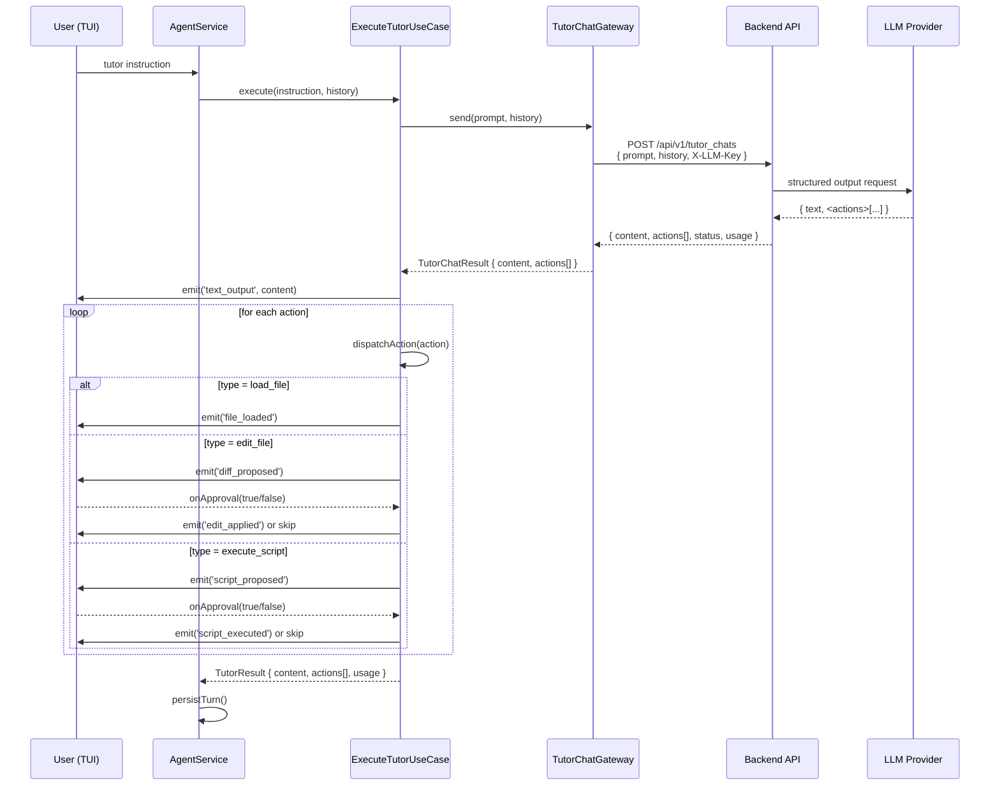
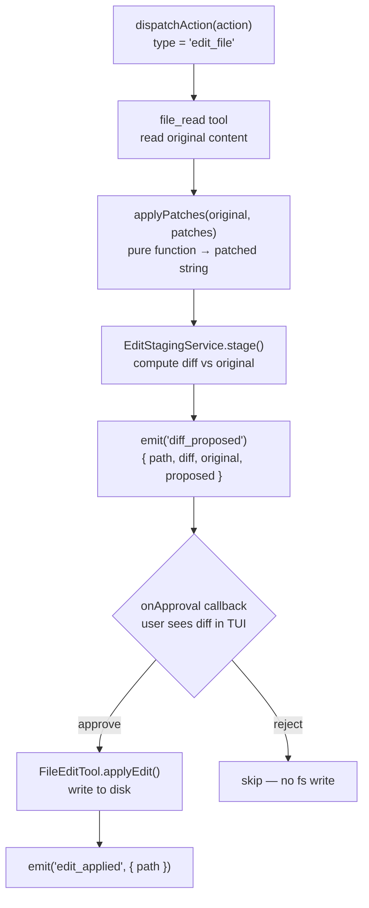
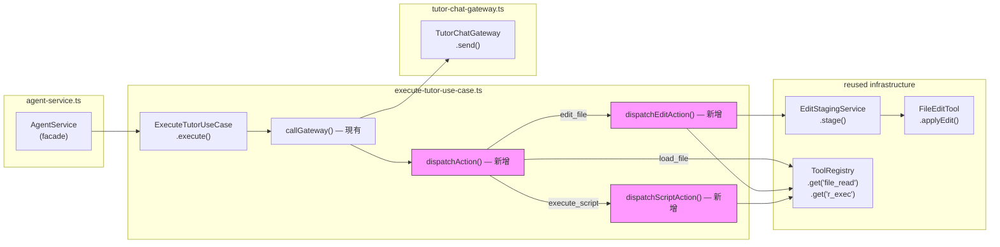
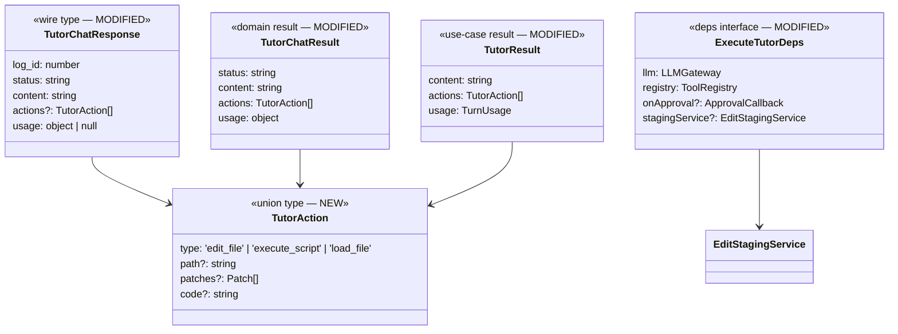

# Tutor Actions Implementation Plan

**Date:** 2026-06-02  
**Status:** Design approved — ready to implement  
**Depends on:** [2026-06-01-tutor-action-triggering.md](./2026-06-01-tutor-action-triggering.md)

---

## TL;DR

Backend 這次 LLM call 決定 `actions[]`（structured output），Frontend 只負責**執行**這些 actions（approval gate、diff、寫檔、執行 script）。Frontend 不另外呼叫 LLM。

Token 限制（4000 output）→ `edit_file` 用 **search-replace patch** 而非完整 content。

---

## Constraint: 4000 Output Token Limit

LLM key 的 output 上限 4000 tokens。Tutor 文字回覆本身約 200–600 tokens，剩餘不夠承載完整檔案 content。因此：

| 方案 | Token cost | 決定 |
|------|-----------|------|
| `edit_file` 送完整 content | 高（一個中型 R 檔就 500+ tokens） | ❌ |
| `edit_file` 送 search-replace patch | 低（每個 patch ~15 tokens） | ✅ |

---

## TutorAction Schema（前後端合約）

```ts
// 這是前後端的共同合約，先確認再動手
type TutorAction =
  | { type: 'edit_file';      path: string; patches: Array<{ search: string; replace: string }> }
  | { type: 'execute_script'; code: string }
  | { type: 'load_file';      path: string }
```

### Backend LLM Prompt 約定

Backend 在 system prompt 尾端加入：

```
If you want to suggest code changes, append a JSON block after your explanation:

<actions>
[
  {
    "type": "edit_file",
    "path": "hw11.R",
    "patches": [{ "search": "mean(x)", "replace": "mean(x, na.rm=TRUE)" }]
  }
]
</actions>

Rules:
- Only include <actions> when you have a concrete suggestion.
- Use search/replace strings that are unique in the file (enough context to be unambiguous).
- For execute_script: short, self-contained R code only.
- Never include actions when status is "forbidden".
```

---

## Data Flow Diagrams

### 1. Overall Request/Response Flow



---

### 2. `edit_file` Action 細部流程



---

### 3. Function Call Chain（現有 vs 新增）



---

### 4. 型別變更關係



---

## Implementation Steps

### Step 1：確認 schema（和 backend 對齊）

- [ ] 確認 backend 那邊 `actions[]` 的 JSON 格式和上方 schema 一致
- [ ] 確認 backend 會在 `forbidden` status 時省略 `actions`

---

### Step 2：`tutor-chat-gateway.ts`

**改動：**
1. 新增 `TutorAction` export type
2. `TutorChatResponse` 加 `actions?: TutorAction[]`
3. `TutorChatResult` done/unavailable branch 加 `actions: TutorAction[]`
4. `send()` map 時加 `actions: data.actions ?? []`

**檔案：** [tutor-chat-gateway.ts](../tyla/src/infrastructure/api/tutor/tutor-chat-gateway.ts)

---

### Step 3：`execute-tutor-use-case.ts`

**改動：**
1. `TutorResult` 加 `actions: TutorAction[]`
2. `ExecuteTutorDeps` 加：
   - `onApproval?: (edit) => Promise<boolean>`
   - `stagingService?: EditStagingService`（inject 而非 new）
3. `callGateway()` 在 `text_output` emit 後，loop emit action proposals
4. 新增 private methods：
   - `dispatchAction(action)`
   - `dispatchEditAction(action)` — 讀檔 → applyPatches → stage → emit diff_proposed → onApproval
   - `dispatchScriptAction(action)` — emit script_proposed → onApproval → r_exec
5. 新增 pure helper `applyPatches(original, patches)` — 找 search string，替換成 replace
6. local fallback `callLLMStream()` 回傳時 `actions: []`

**檔案：** [execute-tutor-use-case.ts](../tyla/src/application/use-cases/execute-tutor-use-case.ts)

---

### Step 4：`agent-service.ts`

**改動：**
在構造 `ExecuteTutorUseCase` 時注入：
- `stagingService`（和 `ExecuteInstructionUseCase` 共用同一個 instance）
- `onApproval`（同一個 callback，已在 instruction use case 那邊定義）

**檔案：** [agent-service.ts](../tyla/src/application/services/agent-service.ts)

---

### Step 5：TUI event mapper（新增 2 個 handlers）

| Event | Payload | TUI 行為 |
|-------|---------|---------|
| `diff_proposed` | `{ path, diff, original, proposed }` | 已有 — 重用現有 diff view |
| `script_proposed` | `{ code }` | 新增 — 顯示 code block + Run/Skip |
| `file_loaded` | `{ path, content }` | 新增 — 顯示「已載入 xxx」提示 |

---

### Step 6：`applyPatches` edge cases

`applyPatches(original: string, patches: Patch[]): string` 要處理：

- `search` 字串在檔案中**找不到** → emit warning，skip 此 patch（不中止）
- `search` 字串出現**多次** → 只替換第一次，emit warning（tutor 的 search 應該足夠 specific）
- patches 依序套用（前一個 replace 的結果是下一個 search 的輸入）

---

## Files Changed Summary

| 檔案 | 改動類型 | 大小 |
|------|---------|------|
| `infrastructure/api/tutor/tutor-chat-gateway.ts` | type 新增 + map 修改 | 小 |
| `application/use-cases/execute-tutor-use-case.ts` | 新增 3 個 private methods + deps 擴充 | 中 |
| `application/services/agent-service.ts` | 構造 tutor use case 時多注入 2 個 deps | 小 |
| TUI event mapper | 新增 2 個 event handlers | 小–中 |

---

## Out of Scope

- Tutor local fallback 支援 actions（`callLLMStream` 繼續回傳 `actions: []`）
- 讓 tutor 自主 run script（不 approval）
- Tutor 進入 ReAct loop（那是 `agent` 的職責）
- `forbidden` status 帶 actions
