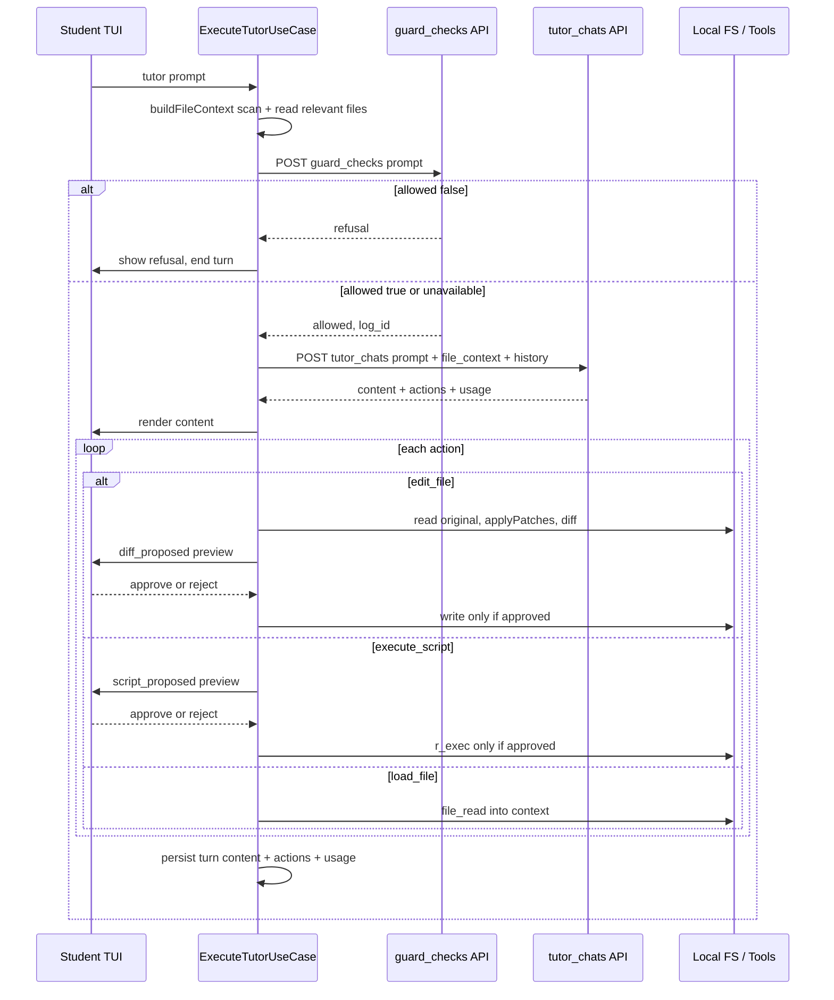
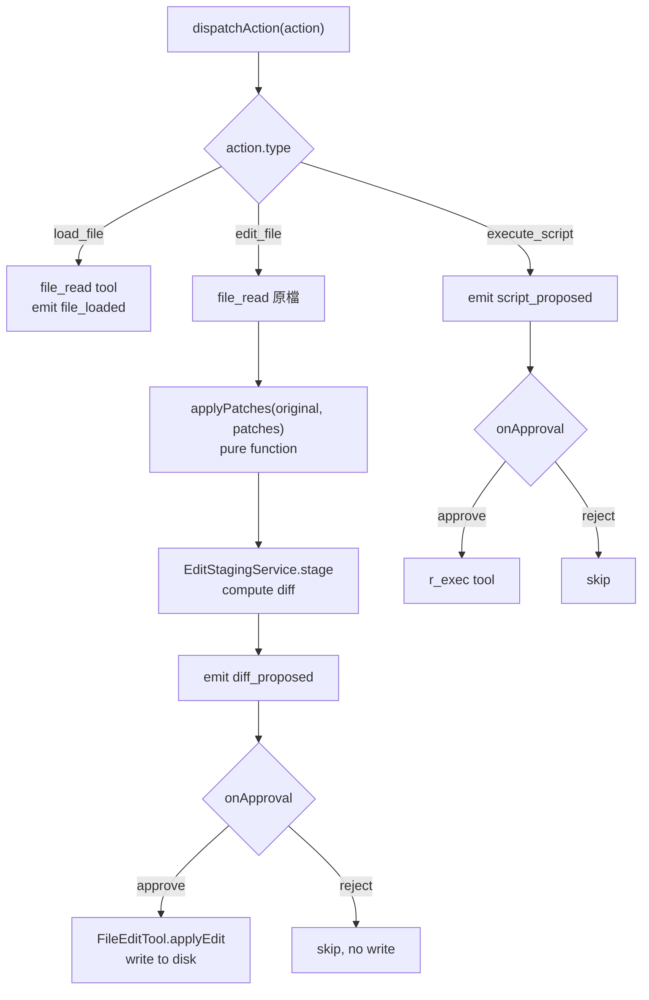

# Agentic Tutor — ReAct-driven Pipeline (guard → file_context → actions → approval)

**Date:** 2026-06-03
**Status:** Decisions locked for **Phase 1 = Option B** — ready to spec the implementation
**Owner:** MindyCLI (frontend TUI) + Tyla-api (backend)

> **這份文件的目的**：把最近幾個分散的改動收斂成一條完整的 tutor pipeline，並把其中一個**有爭議的決定**攤開討論 —— tutor 是否該變成 agentic（ReAct）。

---

## 0. 為什麼要這份 plan

最近四條線同時在動，彼此其實是同一條 pipeline 的不同片段：

| # | 來源 | 講的是 |
|---|------|--------|
| 1 | 本次需求（第 1 點） | `execute-tutor-use-case.ts` 不該是單純 chatbot，要結合 **ReAct markers**，讓 LLM 在推理中自行決定何時用工具 |
| 2 | [2026-06-02-gateway-file-context.md](./2026-06-02-gateway-file-context.md) | 學生下 prompt 時要帶 **file_context** 上後端 |
| 3 | [api_guard_checks.md](../../Tyla-api/doc/api_guard_checks.md) | 先過 **guard_checks**，OK 才把 prompt + file_context + history 送後端 |
| 4 | [2026-06-02-tutor-actions-implementation.md](./2026-06-02-tutor-actions-implementation.md)、[2026-06-02-agentic-tutor-slide-revised.md](./2026-06-02-agentic-tutor-slide-revised.md) | 後端回 `content + actions[]`；TUI 依 actions 行動，**edit 走 diff → preview → approval → write** |

**這份 plan 明確修訂了一個先前的決定。** [2026-06-01-tutor-action-triggering.md](./2026-06-01-tutor-action-triggering.md) 與 [2026-06-02-tutor-actions-implementation.md](./2026-06-02-tutor-actions-implementation.md) 都把「tutor 進入 ReAct loop」列為 **out of scope**（理由：tutor 應該教學、不該自主行動，ReAct 是 `agent` 的職責）。本次需求第 1 點要把 ReAct 帶回 tutor。**兩者可以調和** —— 關鍵是把「推理用的讀取工具」與「會改檔的寫入動作」分開對待。下面 §4 處理這個張力。

---

## 1. 目前 tutor 的樣子（baseline）

`execute-tutor-use-case.ts` 今天有兩條路：

```
execute(instruction, history)
  ├─ if tutorChatGateway → callGateway()        ← production：POST /api/v1/tutor_chats，回傳 flat content
  └─ else（offline fallback）
       1. buildProjectContext()   file_scan
       2. readRelevantFiles()     依檔名/副檔名比對讀檔
       3. runGuard()              本地 guard agent
       4. assemblePrompt()        把 context + 檔案內容塞進 system prompt
       5. callLLMStream()         串流 token，回 { content, usage }
```

三個關鍵事實（決定了改動範圍）：

1. **檔案只是 INPUT，從來不是 OUTPUT action**。`readRelevantFiles()` 在 LLM 跑之前把檔案內容塞進 prompt；LLM 無法在回答途中要求新的檔案。
2. **輸出是一個 flat string**。`callGateway()` 和 `callLLMStream()` 都回 `{ content, usage }`，用 `emit('text_output', { content })` 丟給 TUI 純文字渲染。
3. **gateway 的 wire 也是 flat string**：`TutorChatResponse = { log_id, status, content, usage }`，沒有 `actions`，guard 由後端內含（`status: 'forbidden'`）。

也就是說：**tutor 輸出路徑上沒有 parser、沒有 marker、沒有 JSON** —— 要讓它「知道何時 load / edit / execute」，這條路目前是空的。

---

## 2. 目標 pipeline（一張圖看懂）

決議：**guard 拆成獨立前置呼叫**（不再依賴 tutor_chats 內含 guard）。



對齊四個需求點：

- **第 2 點 file_context** → `buildFileContext()`（§3.2）。
- **第 3 點 guard 前置** → 獨立 `POST /guard_checks`，allowed 才往下（§3.1）。
- **第 1 點 ReAct** → §4 兩個架構選項。
- **第 4 / 5 點 actions + approval** → `dispatchAction()` + Pattern B approval gate（§5）。

---

## 3. Wire format 變更

### 3.1 guard_checks —— 獨立前置呼叫（統一 `status` enum）

**決議（Q1 + Q3 合併）**：guard_checks 與 tutor_chats **共用同一個 `status` enum**，前端用同一套分流邏輯處理兩個端點。

```ts
type ApiStatus = 'done' | 'forbidden' | 'error' | 'unavailable';
```

guard_checks response：

```jsonc
{
  "log_id":  42,
  "status":  "done",                                       // 見下表
  "refusal": "...",                                        // 只在 forbidden 時出現
  "usage":   { "input_tokens": 120, "output_tokens": 8 }   // judge call 也吃 token
}
```

前端依 `status` 分流（**只依賴 `status` + `refusal` 兩個欄位**）：

| `status` | 意義 | 前端行為 |
|----------|------|---------|
| `done` | guard 過關 | 往下打 tutor_chats（送 prompt + file_context + history） |
| `forbidden` | guard 擋下 | 顯示 `refusal`，結束本回合，**不打 tutor_chats** |
| `unavailable` | guard LLM 不可用，fail-open | 往下打 tutor_chats，log warning（不顯示給學生） |
| `error` | 後端/judge 出錯 | 顯示錯誤、建議重試 |

兩個設計取捨：

- **狀態放 body 而非 HTTP code**：現況靠 HTTP 200/202 區分 allowed/unavailable，改成統一用 body `status` 後，HTTP 一律 200（只有 malformed request / 缺 key 才回 4xx，例如 401 missing `X-LLM-Key`）。這樣 guard 與 tutor 兩端點的解析程式碼可共用。
- **`usage` 開始有兩筆**：guard judge call 與 tutor call 各吃一次 token。前端每回合要把兩筆 usage **分別記錄或加總**（影響 [token status bar](./2026-05-29-issue-3-tui-token-status-bar.md)）。建議 persist turn 時分開存 `guardUsage` / `tutorUsage`，顯示時加總。
- 後端可保留 `attack_probability` / `evaluation` 供 log 與分析，**前端不讀**。

新增前端元件：`GuardCheckGateway`（對照既有 `TutorChatGateway` 的形狀），組 body + 四個 LLM header + 解析統一 `status`。

### 3.2 tutor_chats request —— 加 file_context

承 [2026-06-02-gateway-file-context.md](./2026-06-02-gateway-file-context.md)：

```ts
interface TutorChatRequest {
    course_id:     string;
    project_id:    string;
    student_id:    string;
    prompt:        string;
    history:       SessionMessage[];
    file_context?: string;   // ← 前端預先組好、已做 token budget 截斷的純文字
}
```

`file_context` 由前端用既有的 `buildProjectContext()` + `readRelevantFiles()` 組成（後端在遠端、碰不到學生本機檔案）。`buildFileContext()` helper：

```ts
private async buildFileContext(instruction: string): Promise<string> {
    const { projectContext, scannedFiles } = await this.buildProjectContext();
    const fileContents = await this.readRelevantFiles(instruction, scannedFiles);
    const parts: string[] = [];
    if (projectContext) parts.push(`## Project Context\n${projectContext}`);
    if (fileContents)   parts.push(`## File Contents\n${fileContents}`);
    return this.truncateToTokenBudget(parts.join('\n\n'), MAX_CONTEXT_TOKENS);
}
```

offline path 與 gateway path **共用同一個** `buildFileContext()`，token budget 邏輯集中一處。

### 3.3 tutor_chats response —— 加 actions[]

承 [2026-06-02-tutor-actions-implementation.md](./2026-06-02-tutor-actions-implementation.md) 與你貼的格式：

```jsonc
{
  "log_id":  101,
  "status":  "done",                         // 共用 ApiStatus: done | forbidden | error | unavailable
  "content": "Step 1: ...\nHint 1: ...",     // 給學生看的文字
  "actions": [
    { "type": "edit_file", "path": "hw11.R",
      "patches": [ { "search": "mean(x)", "replace": "mean(x, na.rm=TRUE)" } ] }
  ],
  "usage": { "input_tokens": 4321, "output_tokens": 512 }
}
```

```ts
type TutorAction =
  | { type: 'edit_file';      path: string; patches: Array<{ search: string; replace: string }> }
  | { type: 'execute_script'; code: string }
  | { type: 'load_file';      path: string };
```

> **Token 約束（沿用既有決定）**：LLM key output 上限 4000 tokens，tutor 文字本身約 200–600，不夠塞完整檔案 content → `edit_file` 一律用 **search-replace patch**，不送完整檔案內容。

**型別連鎖改動**：`TutorChatResponse` 加 `actions?`、`TutorChatResult` done/unavailable branch 加 `actions: TutorAction[]`（`send()` map 時 `actions: data.actions ?? []`）、`TutorResult` 加 `actions`。`forbidden` / `error` 一律不帶 actions。

> **`forbidden` 在前置 guard 之後的角色（Q3 後半）**：guard 既然前置，正常流程下 tutor_chats 只會收到已過關的 prompt，`forbidden` 幾乎不會出現。**保留它作為後端第二道防線**（backend tutor 仍可在偵測到異常時 refuse），同時讓兩個端點 enum 一致 —— 不刪、但視為 rare path。新增 `error` 讓後端能在 body 明確標示失敗，而非只靠 HTTP 5xx。`TutorChatGateway` 的 status union 補上 `'error'`。

---

## 4. ⭐ 核心爭議：ReAct loop 跑在前端還是後端？

第 1 點「結合 ReAct markers，讓 LLM 在推理中決定何時用工具」可以有兩種落地，差異很大。**兩個都列在這裡供討論。**

### 共同前提

把工具分兩類，這是調和「ReAct」與「approval gate」的關鍵：

- **讀取/推理類**（`file_read`、`pdf_read`、`r_exec` read-only、`file_scan`）—— 安全、只是蒐集 context，可以自動跑。
- **寫入/副作用類**（`edit_file` 寫檔、`execute_script` 跑 R）—— **一律走 approval gate**，LLM 永不直接落地。

無論選 A 或 B，**寫入類永遠是 proposal → 學生核可 → 執行**（§5）。差別只在「讀取類的決策在哪裡發生」。

### Option A — 前端編排 ReAct loop

`ExecuteTutorUseCase` 重用既有 [`ReActLoop`](../tyla/src/application/orchestration/react-loop.ts)，但只註冊**讀取類**工具，**不註冊** `file_edit`：

```
loop（最多 N 步，前端跑）：
  POST tutor_chats(prompt + file_context + history + scratchpad)
    ← [THOUGHT] ... [ACTION {"tool":"file_read","input":{"path":"data.csv"}}]
  前端就地執行 file_read → [OBSERVATION] ...
  POST tutor_chats(... + observation)
    ← [ANSWER] <文字> + actions[]（寫入類）
最後：render content；dispatch 寫入類 actions → approval
```

- ✅ **真正的「推理中決定用工具」**，而且工具跑在**學生本機檔案**上 —— LLM 可在回答途中臨時抓 file_context 沒帶到的新檔。
- ✅ 直接重用既有 `ReActLoop` 的 parser（`[THOUGHT]/[ACTION]/[OBSERVATION]/[ANSWER]`）、`consecutiveErrors` 保護、`ToolRegistry`。
- ❌ **每回合多次往返後端**（每步一次 LLM call）；後端 tutor 端點要變成「可接 scratchpad 的單步推理」而非「一次給完」。
- ❌ 失去單次串流 UX（`ReActLoop` 用 `sendPrompt` 非 streaming）。
- ❌ guard 語意：guard 在 **loop 前跑一次**（對原始 prompt）即可；loop 內的 observation 是工具輸出、不再過 guard。
- ⚠️ 「tutor 不該自己做功課」的風險要靠 prompt/policy 控制（讀檔可以，給答案不行）。

### Option B — 後端推理，前端只執行

後端 tutor LLM 在**伺服器內部**完成推理（ReAct 收斂成 structured output），**單次**回 `content + actions[]`。前端只 dispatch actions。

```
POST guard_checks → allowed
POST tutor_chats(prompt + file_context + history)
  ← { content, actions[], usage }    // 單次往返
render content；dispatch actions → 寫入類走 approval
```

- ✅ **最接近你貼的 response 格式**與前兩份 plan 的設計；單次往返、單次 guard、實作最小。
- ✅ 前端職責乾淨：guard gate + file_context 組裝 + action dispatch + approval。
- ✅ `actions[]` 本身就是「LLM 推理後決定要用的工具」—— 只是決策在後端、落地在前端。
- ❌ LLM **無法在推理途中**臨時抓 file_context 以外的本機新檔（受限於前端一開始送上去的 context）。
- ❌ 「ReAct markers」變成後端內部細節，前端看不到 `[THOUGHT]/[ACTION]`。

### 並排比較

| | Option A 前端 ReAct | Option B 後端推理 |
|---|---|---|
| 「推理中決定用工具」 | ✅ 前端就地執行讀取工具 | ⚠️ 決策在後端、收斂成 actions |
| 臨時抓 file_context 外的新檔 | ✅ 可以 | ❌ 不行 |
| 後端往返次數/回合 | 多次 | 一次 |
| 串流 UX | ❌ 失去 | ✅ 可保留 |
| guard 呼叫 | loop 前一次 | 一次 |
| 重用既有 `ReActLoop` | ✅ 直接重用 | — |
| 改動規模 | 中–大（前端 loop + 後端單步端點） | 小–中（型別 + dispatch） |
| 與前兩份 plan 一致 | 修訂它們 | 延續它們 |

### 決議（Phase 1 = Option B；Option A = Phase 2）

**Phase 1 鎖定 Option B**（後端推理、前端執行、單次往返）；**Option A（前端 ReAct）延後到 Phase 2** 視需求再評估。理由：

1. **Option B 一次到位且風險低** —— 型別連鎖 + `dispatchAction()` + approval 都已在 [2026-06-02-tutor-actions-implementation.md](./2026-06-02-tutor-actions-implementation.md) 設計好，可立即實作。它已經滿足第 4、5 點，且 `actions[]` 已是「LLM 決定的工具使用」。
2. **第 1 點的真正價值在「臨時抓新檔」** —— 只有當 file_context 預載不夠、LLM 需要回答途中拉新檔時，Option A 才有不可取代的好處。建議先用 file_context 預載涵蓋大多數情境，量到「LLM 抱怨看不到某檔」的頻率後，再決定是否上 Option A。
3. **兩者共用 §5 的 approval gate** —— 先做 B 不會浪費；A 是在 B 之上把「讀取決策」從後端移到前端 loop，approval/型別/事件都可沿用。

> 換句話說：**Option B 是骨架，Option A 是把讀取側升級成真 ReAct。** 寫入側（approval gate）兩者完全相同，先建好它最划算。

---

## 5. Action dispatch + approval gate（兩個 Option 共用）

`callGateway()` 在 `emit('text_output', content)` 後，逐一 dispatch `actions[]`：



重用既有 infra（**不新建**）：`EditStagingService.stage()`、`FileEditTool.applyEdit()`（唯一 `fs.writeFileSync` 落地點）、`ToolRegistry.get('file_read' | 'r_exec')`、`onApproval` callback（與 `ExecuteInstructionUseCase` 共用同一個）。

`applyPatches(original, patches)` edge cases（沿用既有設計）：
- `search` 找不到 → emit warning、skip 該 patch，不中止。
- `search` 出現多次 → 只換第一次、emit warning（tutor 的 search 應夠 specific）。
- patches 依序套用（前一個 replace 結果是下一個 search 的輸入）。

---

## 6. 要動的檔案

| 檔案 | 改動 | Option |
|------|------|--------|
| `infrastructure/api/guard/guard-check-gateway.ts` | **新增** GuardCheckGateway（前置 guard 呼叫，解析 200/202/4xx） | A+B |
| [tutor-chat-gateway.ts](../tyla/src/infrastructure/api/tutor/tutor-chat-gateway.ts) | `send()` 加 `fileContext?` 參數 → body `file_context`；`TutorChatResponse`/`TutorChatResult` 加 `actions` | A+B |
| [execute-tutor-use-case.ts](../tyla/src/application/use-cases/execute-tutor-use-case.ts) | 抽 `buildFileContext()`；`callGateway()` 前置 guard + dispatch actions；`TutorResult` 加 `actions`；新增 `dispatchAction/dispatchEditAction/dispatchScriptAction` + `applyPatches` | A+B |
| [execute-tutor-use-case.ts](../tyla/src/application/use-cases/execute-tutor-use-case.ts) | （Option A 額外）用 `ReActLoop` 包 gateway 單步呼叫，註冊唯讀工具、withhold `file_edit` | A only |
| [agent-service.ts](../tyla/src/application/services/agent-service.ts) | 構造 tutor use case 時注入 `guardCheckGateway`、`stagingService`、`onApproval` | A+B |
| TUI event mapper | 新增 `script_proposed`、`file_loaded` handler；`diff_proposed` 重用 | A+B |
| 後端 `POST /api/v1/tutor_chats` | 接 `file_context` 注入 system prompt；回 `actions[]`；移除內含 guard（改由 guard_checks 負責） | A+B |
| 後端 `POST /api/v1/guard_checks` | 確認/精簡回傳格式（見 §7） | A+B |

---

## 7. Open questions（討論定案用）

1. ✅ **RESOLVED（Q1 + Q3 合併）— 統一 `status` enum**。guard_checks 與 tutor_chats 共用 `ApiStatus = 'done' | 'forbidden' | 'error' | 'unavailable'`，狀態放 body、HTTP 一律 200（malformed/auth 才 4xx）。guard_checks 回 `{ log_id, status, refusal?, usage }`，前端只讀 `status` + `refusal`。詳見 §3.1。
2. ✅ **RESOLVED — guard 只看 prompt，不看 file_context**。維持現況：guard_checks 只審 prompt，不把 file_context 送 judge。理由：省 judge token 成本；「答案藏檔案裡誘導」屬 edge case，不為它增加每回合成本。日後若觀測到此類規避再重開。
3. ✅ **RESOLVED（併入 Q1）**。`forbidden` 保留為**後端第二道防線**（rare path，前置 guard 後正常不會觸發），讓兩端點 enum 一致；另加 `error` 供 body 明確標示失敗。詳見 §3.3。
4. 🅰️ **DEFERRED 到 Option A / Phase 2**。Phase 1 做 Option B（單次往返），不需要 `scratchpad`/`observation` 續跑端點。待 Phase 2 評估前端 ReAct 時再設計。
5. 🅰️ **DEFERRED 到 Option A / Phase 2**。loop 內 observation 不過 guard 的安全假設，等 Phase 2 真要做前端 loop 時再確認。Phase 1（Option B）guard 只在前置呼叫一次，無此問題。
6. ✅ **RESOLVED — `execute_script` 限 read-only**。職責分離：改檔走 `edit_file`（diff 預覽），跑/算走 `execute_script` 且**沿用 `r_exec` 既有 read-only guard**（擋寫檔/裝套件/刪檔）。approval + read-only guard 雙重防護；學生即使誤按 Run 也不會破壞檔案。

---

## 8. 一句話總結

> Tutor 從「唯讀 chatbot」升級成「會提議動作的 agentic tutor」：**先過 guard，帶著 file_context 問後端，後端回文字 + 結構化 actions，TUI 執行 actions —— 但每一次改檔都還是 diff → preview → 學生核可 → 落地。**
> 老師不會幫你寫作業；tutor 也不會偷偷改你的檔案。

---

## 附錄：與既有 plan 的關係

- **延續**：[gateway-file-context](./2026-06-02-gateway-file-context.md)（file_context）、[tutor-actions-implementation](./2026-06-02-tutor-actions-implementation.md)（actions + approval）、[agentic-tutor-slide-revised](./2026-06-02-agentic-tutor-slide-revised.md)（wire 格式）。
- **修訂**：[tutor-action-triggering](./2026-06-01-tutor-action-triggering.md) 把「tutor 進 ReAct loop」列為 out-of-scope —— 本 plan 在 §4 把它**有條件地**帶回（只開放唯讀工具、寫入仍走 approval），作為 Option A / 第二階段。
- **整合**：[api_guard_checks](../../Tyla-api/doc/api_guard_checks.md) 從「tutor_chats 內含」改為**獨立前置呼叫**。
