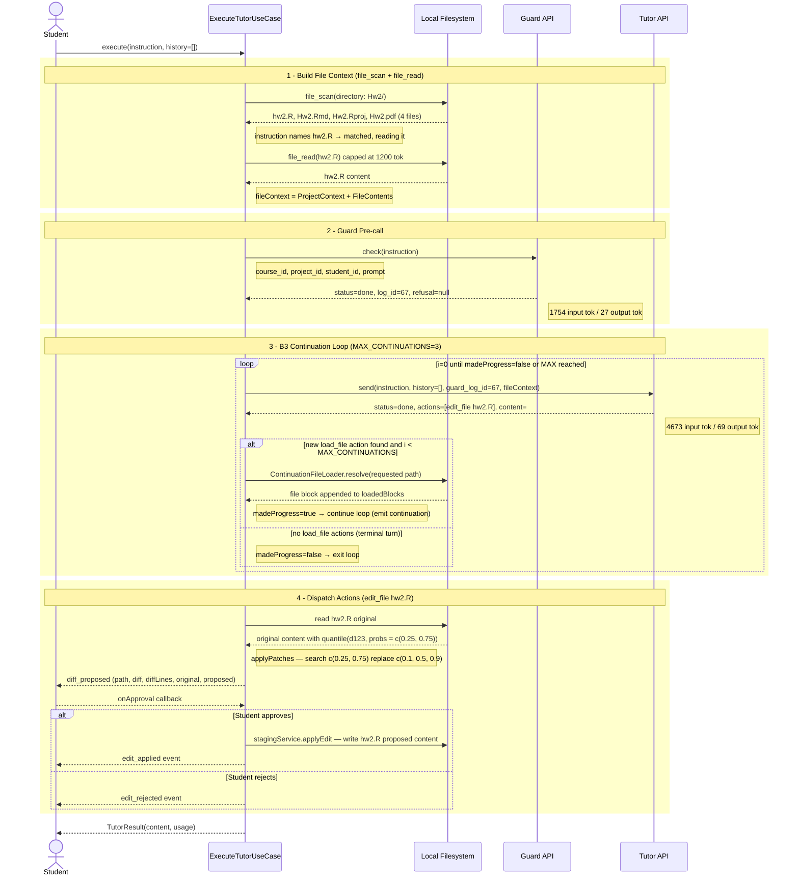

# ExecuteTutorUseCase — Sequence Diagram

> 示例情境：學生詢問 hw2.R 分位數錯誤，Guard 放行後 Tutor 回傳 edit_file 動作，學生核准後寫入磁碟。

## 流程說明

### Phase 0 — Gateway Guard（程式碼 L125–129）
呼叫前先確認 `guardCheckGateway` 和 `tutorChatGateway` 都已注入，否則拋出 friendly error，不走進後續流程。

### Phase 1 — Build File Context（L134–135, L305–321）
- `file_scan` 掃描工作目錄，回傳分類檔案清單
- `readRelevantFiles()` 比對 instruction 中提到的檔名（case-insensitive）
- 若無命中，`readFallbackFiles()` 自動讀取最多 5 個 rScripts/rMarkdown
- 每個檔案受 `PER_FILE_TOKEN_CAP=1200 tok` 限制，整批受 `PER_TURN_FILE_CONTEXT_TOKEN_CAP=2200 tok` 限制

### Phase 2 — Guard Pre-call（L138–159）
- `guardCheckGateway.check(instruction)` → 取得 `log_id`
- `status=forbidden` → 直接回傳 refusal，不呼叫 Tutor
- `status=error` → emit error，不呼叫 Tutor

### Phase 3 — B3 Continuation Loop（L162–222）
- 每次迭代用 `tutorChatGateway.send()` 傳入 `guard_log_id` + `fileContext`
- 若 response 含 `load_file` action → `ContinuationFileLoader.resolve()` 載入檔案，`madeProgress=true`，繼續迴圈
- 無新 `load_file` 或達到 `MAX_CONTINUATIONS=3` → terminal turn，進入 Phase 4

### Phase 4 — Dispatch Actions（L232–288）
- `edit_file`：讀原始檔 → `applyPatches()` → `stageOnly()` → `diff_proposed` event → `onApproval` → 寫入或拒絕
- `execute_script`：`script_proposed` event → `onApproval` → 呼叫 `r_exec` tool

> `load_file` action 在 Phase 3 被 driver 消耗，不會進入 dispatchActions。
