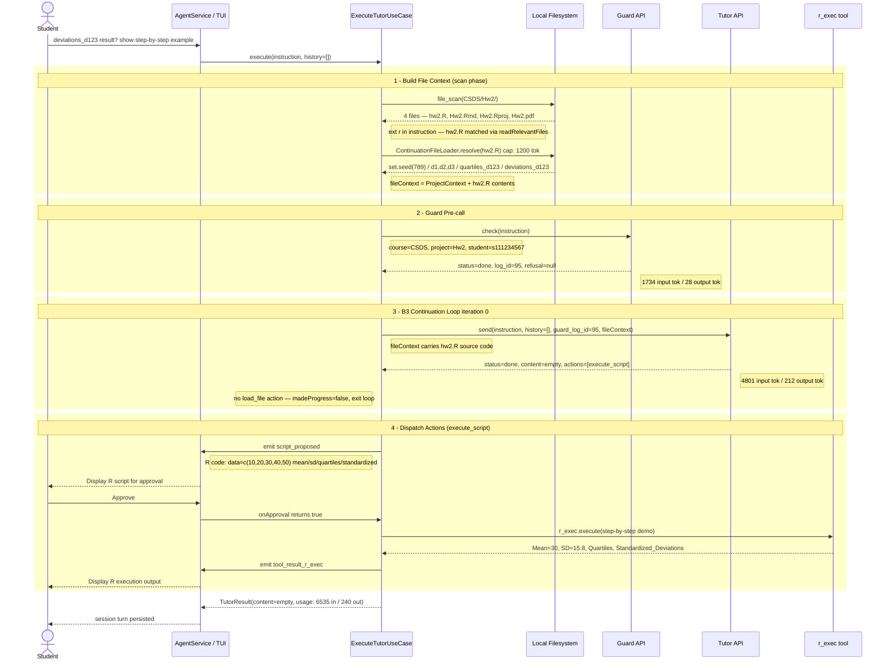

# ExecuteTutorUseCase — Sequence Diagram
## 情境：學生詢問 deviations_d123 的意義，Tutor 回傳 execute_script 示範

> 對應 log 時間：2026-06-08T04:07:49 – 04:07:55 UTC



---

## 各 Phase 對應 log 與程式碼

| Phase | Log 時間戳 | 程式碼位置 | 說明 |
|-------|-----------|-----------|------|
| **1 – Scan** | (tutor REQUEST 前) | `execute-tutor-use-case.ts:305` `buildFileContext()` | 掃描 Hw2/ → 找到 4 個檔。instruction 含 "r"（字母），ext 比對命中 hw2.R → `readRelevantFiles` 非空，跳過 fallback |
| **2 – Guard** | `04:07:49.070Z` → `04:07:51.785Z` | `execute-tutor-use-case.ts:141` | 2.7 秒完成，`log_id=95`，`refusal=null` → 放行 |
| **3 – Tutor** | `04:07:51.788Z` → `04:07:55.153Z` | `execute-tutor-use-case.ts:174` `send()` | 3.4 秒完成；`actions` 只有 `execute_script`，無 `load_file` → `madeProgress=false` → 第一圈即 terminal |
| **4 – Dispatch** | (55.153Z 後) | `execute-tutor-use-case.ts:290` `dispatchExecuteScript()` | `script_proposed` → 等 Student `onApproval` → 呼叫 `r_exec` 執行示範 R 程式 |

---

## 完整 Log

```json
[2026-06-08T04:07:49.070Z] [guard] REQUEST
{
  "course_id": "CSDS",
  "project_id": "Hw2",
  "student_id": "s111234567",
  "prompt": "I don't understand what the deviations_d123 result actually means.Can you show me a tiny example with made-up numbers so I can see what \"standardized deviation from the quartile\" looks like step by step?"
}

[2026-06-08T04:07:51.785Z] [guard] RESPONSE
{
  "log_id": 95,
  "status": "done",
  "refusal": null,
  "usage": {
    "input_tokens": 1734,
    "output_tokens": 28
  }
}

[2026-06-08T04:07:51.788Z] [tutor] REQUEST
{
  "course_id": "CSDS",
  "project_id": "Hw2",
  "student_id": "s111234567",
  "guard_log_id": 95,
  "prompt": "I don't understand what the deviations_d123 result actually means.Can you show me a tiny example with made-up numbers so I can see what \"standardized deviation from the quartile\" looks like step by step?",
  "history": [],
  "file_context": "## Project Context\nScanned: C:\\Users\\Mindy\\Desktop\\CSDS\\Hw2\nTotal files: 4\nProject: Hw2 (rproj)\nR scripts (.R): hw2.R\nR Markdown (.Rmd): Hw2.Rmd\nR Projects (.Rproj): Hw2.Rproj\nDocuments: Hw2.pdf\n\n## File Contents\n### hw2.R\n\r\nset.seed(789)\r\nd1 <- rnorm(n = 500, mean = 15, sd = 5)\r\nd2 <- rnorm(n = 200, mean = 30, sd = 5)\r\nd3 <- rnorm(n = 100, mean = 45, sd = 5)\r\nd123 <- c(d1, d2, d3)\r\n\r\n\r\nquartiles_d123 <- quantile(d123, probs = c(0.1, 0.5, 0.9))\r\nquartiles_d123\r\n\r\n\r\n\r\ndeviations_d123 <- (quartiles_d123 - mean(d123)) / sd(d123)\r\ndeviations_d123\r\n\n\n"
}

[2026-06-08T04:07:55.153Z] [tutor] RESPONSE
{
  "log_id": 96,
  "status": "done",
  "content": "",
  "actions": [
    {
      "type": "execute_script",
      "code": "# Step-by-step example of calculating standardized deviations from quartiles\n# Suppose we have a small dataset:\ndata <- c(10, 20, 30, 40, 50)\n\n# Step 1: Calculate the mean of the dataset\nmean_data <- mean(data)\n\n# Step 2: Calculate the standard deviation of the dataset\nsd_data <- sd(data)\n\n# Step 3: Calculate the quartiles of the dataset\nquartiles_data <- quantile(data, probs = c(0.25, 0.5, 0.75))\n\n# Step 4: Calculate the standardized deviations of quartiles from the mean\nstandardized_deviations <- (quartiles_data - mean_data) / sd_data\n\n# Print results\nlist(Data = data, Mean = mean_data, Standard_Deviation = sd_data, Quartiles = quartiles_data, Standardized_Deviations = standardized_deviations)"
    }
  ],
  "usage": {
    "input_tokens": 4801,
    "output_tokens": 212
  }
}
```

---

## 流程說明

### Phase 1 — Build File Context（L305–321）

- `file_scan` 掃描 `C:\Users\Mindy\Desktop\CSDS\Hw2`，取得 4 個檔案
- `readRelevantFiles()` 對 instruction 做 case-insensitive 比對：
  - instruction 不含 "hw2.r"（完整檔名），但含字母 "r"
  - `path.extname("hw2.r").slice(1)` = `"r"` → `instructionLower.includes("r")` = true → hw2.R 命中
  - Hw2.Rmd ext = "rmd"、Hw2.Rproj ext = "rproj"、Hw2.pdf ext = "pdf" → 皆不在 instruction 中 → 不命中
- hw2.R 透過 `ContinuationFileLoader.resolve()` 讀入，受 `PER_FILE_TOKEN_CAP = 1200 tok` 限制
- `readRelevantFiles` 回傳非空字串 → **跳過 `readFallbackFiles`**

### Phase 2 — Guard Pre-call（L138–159）

- `guardCheckGateway.check(instruction)` 送出 POST，帶 course/project/student/prompt
- 2.715 秒後回傳：`status=done`、`log_id=95`、`refusal=null`
- 不進入 `forbidden` / `error` 分支 → 繼續執行

### Phase 3 — B3 Continuation Loop（L162–222）

- iteration 0：`tutorChatGateway.send(instruction, [], 95, fileContext)`
- Tutor 回傳：`status=done`、`content=""`、`actions=[{type:"execute_script", code:"..."}]`
- `loads = result.actions.filter(a => a.type === 'load_file')` → **空陣列**
- `madeProgress = false` → **不進入下一圈**，直接進入 terminal turn
- emit `text_output`（content 為空）、進入 `dispatchActions`

### Phase 4 — Dispatch Actions（L232–301）

- `dispatchExecuteScript` 被呼叫（`edit_file` 未出現）
- emit `script_proposed`，TUI 顯示 R 程式碼讓 Student 確認
- Student 核准 → `onApproval` 回傳 `true`
- `registry.get('r_exec').execute({code})` 執行示範程式
- emit `tool_result_r_exec` → TUI 顯示輸出結果

### 這次為何沒有 B3 continuation？

Tutor 直接回傳 `execute_script`（示範用的 made-up 數字），不需要額外讀取任何學生檔案，
因此 `load_file` action 為零，迴圈在 iteration 0 即結束。
B3 continuation 只在 Tutor 判斷需要查看更多檔案（`load_file`）時才會觸發第二圈。
