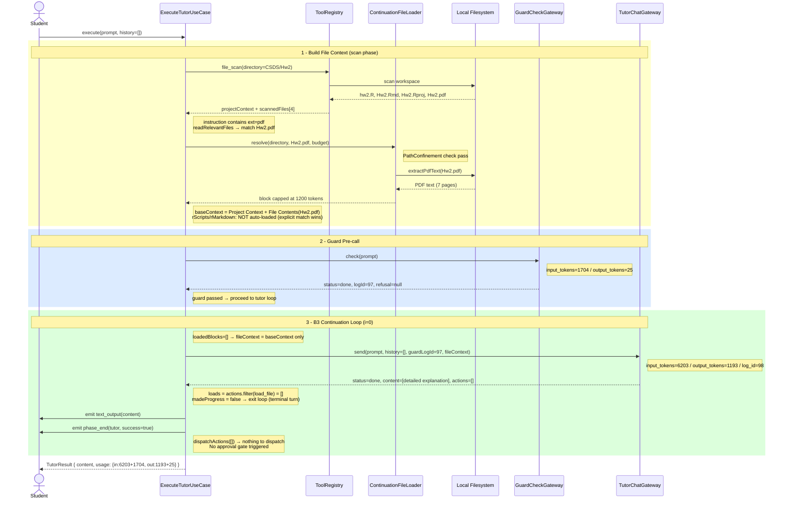

# ExecuteTutorUseCase 循序圖
**Prompt:** `Please explain what I need to submit based on the assignment PDF`
**Date:** 2026-06-08 | **Log IDs:** guard=97, tutor=98

---

## 流程說明

此 prompt 屬於純問答型（no `load_file` / `edit_file` / `execute_script` actions），走完一次 B3 continuation loop 即終止。

### 關鍵決策點

| 步驟 | 決策 | 結果 |
|------|------|------|
| `readRelevantFiles` | instruction 含 `"pdf"` → extension match | 讀取 `Hw2.pdf` |
| Guard response | `status=done`, `refusal=null` | 繼續呼叫 tutor |
| Tutor response (i=0) | `actions=[]` → 無 `load_file` | `madeProgress=false` → terminal turn |
| `dispatchActions` | `actions` 過濾掉 `load_file` 後為空 | 不觸發 approval gate |

---

## Mermaid 循序圖

---

## 各阶段 token 統計

| Phase | input_tokens | output_tokens |
|-------|-------------|--------------|
| Guard | 1,704 | 25 |
| Tutor (turn 0) | 6,203 | 1,193 |
| **Total** | **7,907** | **1,218** |

---

## 程式碼對照（execute-tutor-use-case.ts）

| 圖中步驟 | 對應程式碼 | 行號 |
|---------|-----------|------|
| Build File Context | `buildFileContext()` → `buildProjectContext()` → `readRelevantFiles()` | L305–L321 |
| extension match | `ext.length > 0 && instructionLower.includes(ext)` | L384 |
| extractPdfText | `ContinuationFileLoader.resolve()` calls `extractPdfText` | L110 |
| Guard pre-call | `guardCheckGateway.check(instruction)` | L141 |
| Tutor loop | `for (let i = 0; ; i++)` | L166 |
| No load_file → terminal | `madeProgress = false` → skip `continue` | L212–L215 |
| dispatchActions | 過濾 `load_file` 後呼叫 `dispatchActions` | L220 |
