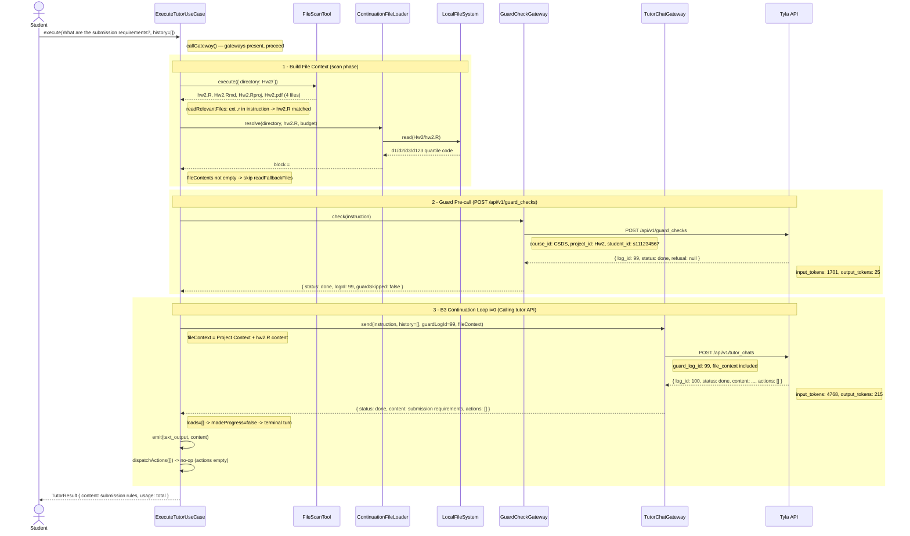

# ExecuteTutorUseCase — Sequence Diagram
# 情境：詢問繳交規定（無 load_file 動作的標準流程）

> **Prompt**: "What are the submission requirements for this homework?"
> **情境說明**：指令本身未包含明確檔名，但副檔名 `.r` 出現在指令文字中（如 "a**r**e", "**r**equirements"），觸發 `readRelevantFiles` 匹配 hw2.R。
> Guard 放行後，Tutor 直接回答（無 `load_file` 動作），B3 continuation loop 一輪結束。



---

## 關鍵路徑說明

### Phase 1 — 檔案脈絡建構

| 步驟 | 方法 | 結果 |
|------|------|------|
| file_scan | `buildProjectContext()` via `ToolRegistry.get('file_scan')` | 掃出 4 個檔案 |
| readRelevantFiles | 比對指令文字與副檔名 | `.r` 出現於 "a**r**e" / "**r**equirements" → hw2.R 匹配（副作用匹配） |
| readFiles | `ContinuationFileLoader.resolve()` | 讀 hw2.R，預算 ~300 tok |
| readFallbackFiles | `if (!fileContents)` | 跳過（已有內容） |

> **預算常數**：`PER_FILE_TOKEN_CAP = 1200`、`PER_TURN_FILE_CONTEXT_TOKEN_CAP = 2200`

### Phase 2 — Guard 安全前置確認

- 不帶 `file_context`（節省 judge token）
- 回傳 `log_id: 99` 供後續 tutor call 使用

### Phase 3 — B3 Continuation Loop

- **i=0**：Tutor 回傳 `actions: []`（無 `load_file`）→ `madeProgress = false` → 直接進入 terminal turn
- 無 continuation，一輪結束
- `dispatchActions([])` → `actions.length === 0` → 立即 return，不進入任何 switch case

### 總 usage（兩次 API 呼叫合計）

| 呼叫 | input_tokens | output_tokens |
|------|-------------|---------------|
| guard_checks (log 99) | 1,701 | 25 |
| tutor_chats (log 100) | 4,768 | 215 |
| **合計** | **6,469** | **240** |

---

## 對照 log

```
[guard] REQUEST  → course_id: CSDS, project_id: Hw2, student_id: s111234567
[guard] RESPONSE → log_id: 99, status: done
[tutor] REQUEST  → guard_log_id: 99, history: [], file_context: Project Context + hw2.R
[tutor] RESPONSE → log_id: 100, status: done, actions: []
```
