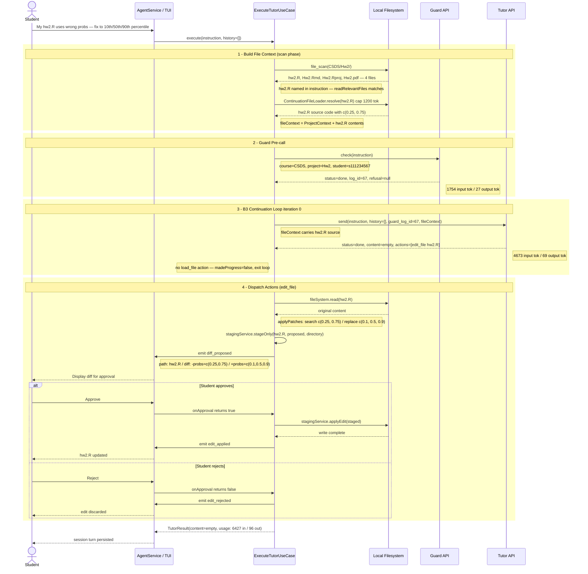

# ExecuteTutorUseCase — 正統 UML 循序圖
## 情境：學生要求修正 probs 向量，Tutor 回傳 edit_file 動作

> 對應 log 時間：2026-06-08T03:06:09 – 03:06:17 UTC  
> 參考情境：[deviations_d123 (execute_script)](2026-06-08-tutor-deviations-d123-sequence.md)



---

## 各 Phase 對應程式碼與 log

| Phase | Log 時間戳 | 程式碼位置 | 說明 |
|-------|-----------|-----------|------|
| **1 – Scan** | (guard REQUEST 前) | `execute-tutor-use-case.ts:305` `buildFileContext()` | 掃描 Hw2/ → 4 個檔；instruction 含 hw2.R 完整檔名 → `readRelevantFiles` 命中，跳過 fallback |
| **2 – Guard** | `03:06:09.306Z` → `03:06:13.671Z` | `execute-tutor-use-case.ts:141` | 4.4 秒完成，`log_id=67`，`refusal=null` → 放行 |
| **3 – Tutor** | `03:06:13.674Z` → `03:06:17.368Z` | `execute-tutor-use-case.ts:174` `send()` | 3.7 秒完成；`actions=[edit_file]`，無 `load_file` → `madeProgress=false` → iteration 0 即 terminal |
| **4 – Dispatch** | (17.368Z 後) | `execute-tutor-use-case.ts:237` `dispatchEditFile()` | 讀原檔 → `applyPatches` → `stageOnly` → `diff_proposed` → `onApproval` → `applyEdit` 或拒絕 |

---

## 完整 Log

```json
[2026-06-08T03:06:09.306Z] [guard] REQUEST
{
  "course_id": "CSDS",
  "project_id": "Hw2",
  "student_id": "s111234567",
  "prompt": "My hw2.R computes quartiles but I accidentally used the wrong probs vector. I have: quantile(d123, probs = c(0.25, 0.75)) But I need the 10th, 50th, and 90th percentiles instead. Can you fix it?"
}

[2026-06-08T03:06:13.671Z] [guard] RESPONSE
{
  "log_id": 67,
  "status": "done",
  "refusal": null,
  "usage": { "input_tokens": 1754, "output_tokens": 27 }
}

[2026-06-08T03:06:13.674Z] [tutor] REQUEST
{
  "course_id": "CSDS",
  "project_id": "Hw2",
  "student_id": "s111234567",
  "guard_log_id": 67,
  "prompt": "My hw2.R computes quartiles but I accidentally used the wrong probs vector...",
  "history": [],
  "file_context": "## Project Context\nScanned: C:\\Users\\Mindy\\Desktop\\CSDS\\Hw2\nTotal files: 4\nProject: Hw2 (rproj)\nR scripts (.R): hw2.R\nR Markdown (.Rmd): Hw2.Rmd\nR Projects (.Rproj): Hw2.Rproj\nDocuments: Hw2.pdf"
}

[2026-06-08T03:06:17.368Z] [tutor] RESPONSE
{
  "log_id": 68,
  "status": "done",
  "content": "",
  "actions": [
    {
      "type": "edit_file",
      "path": "hw2.R",
      "patches": [
        {
          "search": "quantile(d123, probs = c(0.25, 0.75))",
          "replace": "quantile(d123, probs = c(0.1, 0.5, 0.9))"
        }
      ]
    }
  ],
  "usage": { "input_tokens": 4673, "output_tokens": 69 }
}
```

---

## 比較報告：edit_file 情境 vs execute_script 情境

> 對照來源：[2026-06-08-tutor-deviations-d123-sequence.md](2026-06-08-tutor-deviations-d123-sequence.md)

### 兩情境共同結構

兩次互動皆完成於 **B3 iteration 0**（terminal turn），不觸發 continuation loop：

```
Phase 1 → scan + readRelevantFiles(hw2.R)
Phase 2 → guardCheckGateway.check() → log_id
Phase 3 → tutorChatGateway.send() → actions[]，無 load_file → madeProgress=false
Phase 4 → dispatchActions(actions)
```

fileContext 皆帶入 hw2.R 全文。Guard 皆 `status=done`，`refusal=null`。

---

### 分歧點：Phase 4 Dispatch

| 比較項目 | 本情境（probs-fix） | deviations_d123 情境 |
|---------|-------------------|---------------------|
| Tutor action type | `edit_file` | `execute_script` |
| 學生請求意圖 | 修正程式錯誤（fix） | 說明概念（explain） |
| Phase 4 入口 | `dispatchEditFile()` L237 | `dispatchExecuteScript()` L280 |
| 讀取原始檔 | ✅ `fileSystem.read(hw2.R)` | ✗ 不讀取 |
| applyPatches | ✅ search/replace patch | ✗ |
| stageOnly | ✅ `stagingService.stageOnly()` | ✗ |
| emit 給 TUI | `diff_proposed`（含 diffLines） | `script_proposed`（含 code） |
| 核准後動作 | `stagingService.applyEdit()` → 磁碟寫入 | `registry.get('r_exec').execute()` → R 執行 |
| 核准後 emit | `edit_applied` | `tool_result_r_exec` |
| 磁碟 I/O | 有（fs.writeFileSync） | 無 |
| R 執行 | 無 | 有（r_exec tool） |
| output tokens | 69 | 212 |

### 為何 output tokens 差異大？

- **edit_file**（69 tok）：Tutor 只需產生 `{ type, path, patches[] }` 結構，patch 內容極短（search/replace 各一行）。
- **execute_script**（212 tok）：Tutor 需產生完整的 R demo 程式碼（逐步示範含 comments），token 消耗約 3× 。

### B3 Continuation：兩情境皆未觸發

兩情境的 `actions` 均不包含 `load_file`，因此：

```ts
const loads = result.actions.filter(a => a.type === 'load_file');
// loads = []  →  madeProgress = false  →  exit loop
```

B3 continuation 只在 Tutor 判斷需要額外讀取學生檔案時才會出現（例如：Tutor 不確定某個函式定義在哪個檔案，回傳 `load_file: "utils.R"`）。本次兩情境中，hw2.R 已在初始 fileContext 中完整送出，Tutor 無需額外索取。

### 程式碼對照

```
dispatchEditFile (L237–278)          dispatchExecuteScript (L280–291)
─────────────────────────────────    ──────────────────────────────────
fileSystem.read(absPath)             (無)
applyPatches(original, patches)      (無)
stagingService.stageOnly(...)        (無)
emit diff_proposed                   emit script_proposed
await onApproval                     await onApproval
  → stagingService.applyEdit()         → registry.get('r_exec').execute()
  → emit edit_applied                  → emit tool_result_r_exec
```

兩者共享同一個 `onApproval` callback 接口（Human-in-the-loop gate），確保任何有副作用的動作（寫入磁碟、執行程式）都必須通過學生核准。
